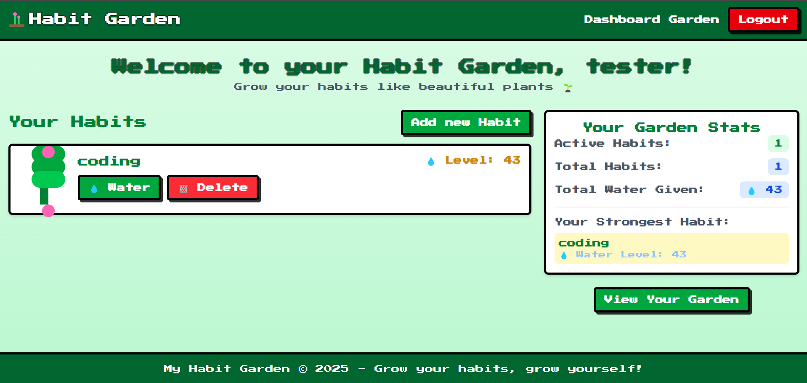
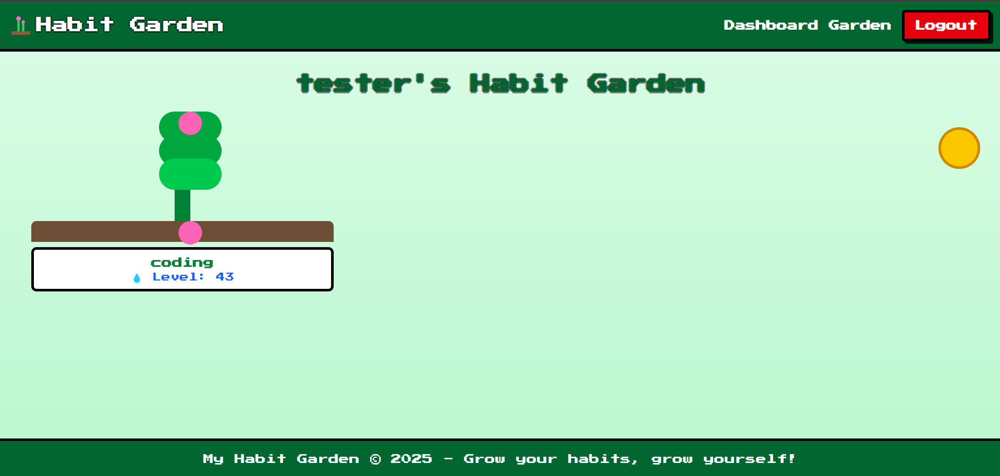

# 🌱 My Habit Garden – Grow Habits Like Plants (8-bit Style)

Build good habits just like growing pixel plants — water them daily and watch them thrive!  
This project turns habit-building into a fun and visual experience inspired by retro 8-bit games 🌿

---

## 🧠 Concept

- Users create **habits or goals** they want to achieve (e.g., drink water, exercise, read books)
- Every time the habit is completed → you earn "water" or "life points" to nurture your plant
- Consistency makes your **plant grow healthier and more beautiful**
- Miss too many days → life points drop → your plant wilts 😂

---

## 🔥 Key Features

### 👤 User Features:

- ✅ Create an account / Login (optional)
- 🌟 Add custom goals (e.g., “Drink 2L of water daily”)
- 📅 Tap “Complete” each day you successfully follow your habit

### 🌿 Habit-to-Plant System:

- 📈 Each habit has its own **plant** with pixel art graphics
- 💧 Completing habits increases life → plant grows!
- 🥀 Missing days reduces life → plant starts to wilt

> 🎮 All visuals follow a retro **8-bit pixel art** aesthetic to make habit tracking more engaging and nostalgic!

---

## 🛠️ Tech Stack

| Frontend                                                    | Backend                                  | Database | Styling                                 | UI Framework                    |
| ----------------------------------------------------------- | ---------------------------------------- | -------- | --------------------------------------- | ------------------------------- |
| [Vite](https://vitejs.dev/) + [React](https://reactjs.org/) | [FastAPI](https://fastapi.tiangolo.com/) | MongoDB  | [TailwindCSS](https://tailwindcss.com/) | [DaisyUI](https://daisyui.com/) |

---

## 📸 Screenshots

### 🌟 Dashboard – Overview of Habits & Plants



### 🌱 Habit Garden – Watch Your Habits Grow!



---

## 🚀 Getting Started

```bash
# 1. Clone the repository
git clone https://github.com/yourusername/my-habit-garden.git
cd my-habit-garden

# 2. Install frontend dependencies
cd frontend
npm install
npm run dev

# 3. Install backend dependencies
cd ../backend
pip install -r requirements.txt
uvicorn main:app --reload
```
